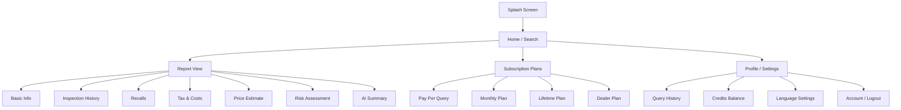

# CarDeal — Frontend UI Structure

## Screen Hierarchy

## Screens

### 1. Splash Screen
- App logo + tagline
- Auto-redirect to Home after 1.5s

### 2. Home / Search
- **Large search bar** (center) — enter license plate
- Locale selector (EN / SV / ZH)
- "Search" button → calls `POST /api/v1/vehicles/query`
- Recent searches list (from local storage)
- Credit balance badge (top-right)

### 3. Report View (scrollable card layout)
Each section is a collapsible card:

| Card | Data Source | Key Display |
|------|------------|-------------|
| **Vehicle Overview** | `basic` | Make, model, year, photo placeholder, plate badge |
| **Specs** | `basic` | Engine, gearbox, drivetrain, dimensions, weight |
| **Ownership** | `ownership` | Timeline of owner changes |
| **Inspection History** | `inspection` | Pass/fail timeline, mileage chart |
| **Recalls** | `recalls` | Alert cards (open = red, fixed = green) |
| **Tax & Running Costs** | `tax` | Annual tax, CO₂, estimated fuel/insurance |
| **Price Estimate** | `price_estimate` | Min–Max range bar, median marker |
| **Risk Assessment** | `risk` | Score gauge (0–100), risk factors list |
| **Condition** | `condition_inference` | Rating badge, confidence %, indicators |
| **Suitability** | `suitability` | Score + recommendation (Buy/Consider/Avoid), pros/cons |
| **AI Summary** | `ai_summary` | Full-text professional analysis |

- **Share Report** button (PDF export / share link)
- **"Cached"** badge if report was served from cache

### 4. Subscription Plans
- 3 tier cards: Pay-Per-Query / Monthly / Lifetime
- Dealer enterprise card (separate)
- Payment integration placeholder

### 5. Profile / Settings
- Query history list (`GET /api/v1/user/history`)
- Credit balance (`GET /api/v1/user/credits`)
- Language selector
- Account management

## Navigation

| Platform | Pattern |
|----------|---------|
| Android | Bottom Navigation Bar (Home, History, Plans, Profile) |
| iOS | Tab Bar Controller (same 4 tabs) |

## Component Library

### Shared Components
- `SearchBar` — plate input with locale picker
- `ReportCard` — collapsible section card
- `ScoreGauge` — circular score indicator (risk, suitability)
- `PriceRangeBar` — horizontal min/max bar with median
- `TimelineView` — vertical timeline (ownership, inspections)
- `AlertBadge` — recall severity indicator
- `CreditBadge` — remaining credits display
- `LoadingOverlay` — skeleton shimmer while fetching
